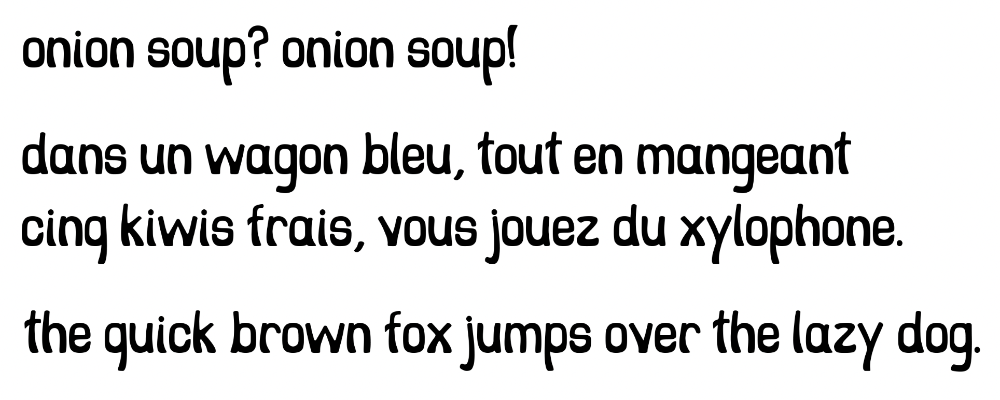

# onion-soup

Onion-Soup is a silly font I created while learning how to use the drawing tools in Glyphs. Because it's an introductory project, the character set is very limited: lowercase letters, an exclamation point, a question mark, a comma, and a period.

## Specimen

## Why is it named onion soup ?

It's the first words I typed with it.